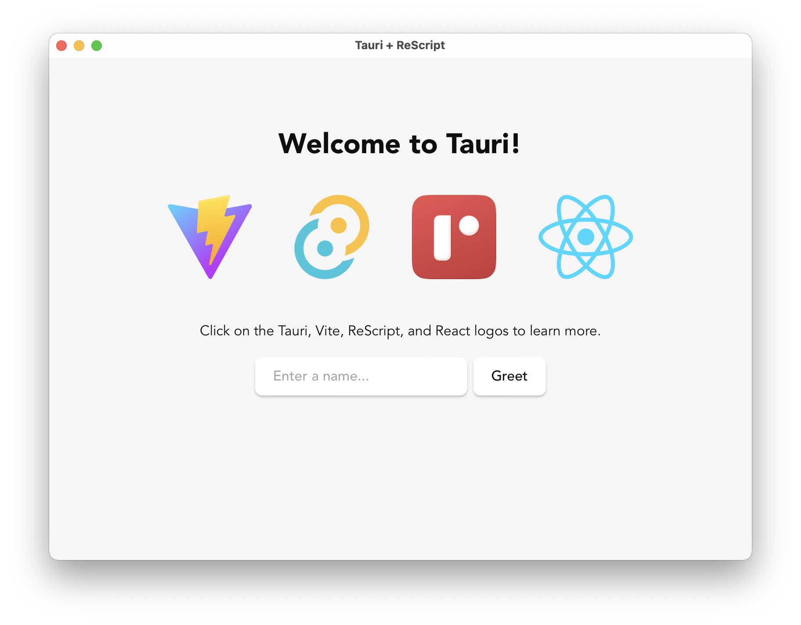

# Tauri + ReScript + React

This template should help get you started developing with Tauri, ReScript, and React in Vite.

## Recommended IDE Setup

- [VS Code](https://code.visualstudio.com/) + [Tauri](https://marketplace.visualstudio.com/items?itemName=tauri-apps.tauri-vscode) + [rust-analyzer](https://marketplace.visualstudio.com/items?itemName=rust-lang.rust-analyzer) + [ReScript](https://marketplace.visualstudio.com/items?itemName=chenglou92.rescript-vscode)
